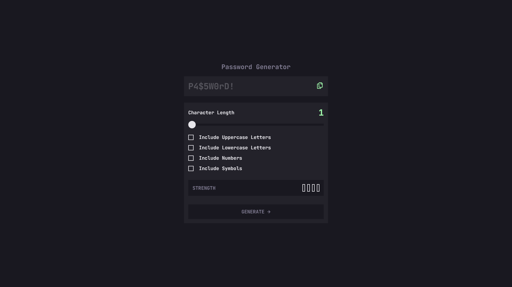
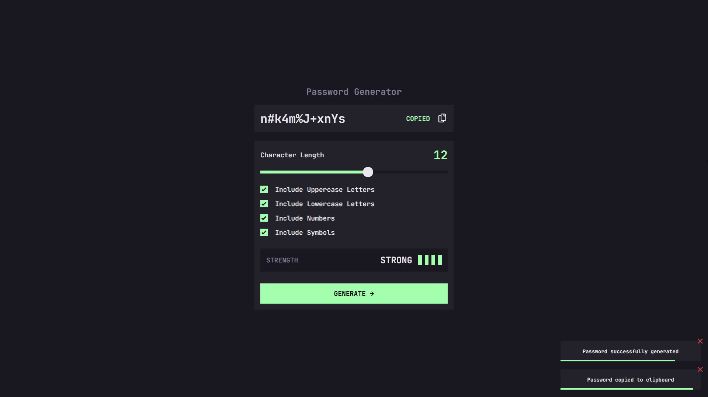

# Frontend Mentor - Password Generator App Solution

This is a solution to the Password Generator App challenge on Frontend Mentor. Frontend Mentor challenges help you improve your coding skills by building realistic projects.

## Table of Contents

- [Overview](#overview)
  - [The Challenge](#the-challenge)
  - [Screenshot](#screenshot)
  - [Links](#links)
- [My Process](#my-process)
  - [Built With](#built-with)
  - [What I Learned](#what-i-learned)
  - [Continued Development](#continued-development)
  - [Useful Resources](#useful-resources)
- [Author](#author)

## Overview

### The Challenge

Users should be able to:

- Generate passwords based on selected inclusion options
- Copy generated passwords to clipboard
- See password strength ratings
- View optimal layout across different device sizes
- See hover and focus states for interactive elements
- Receive visual feedback through notifications

### Screenshot




### Links

- Solution URL: [Add solution URL here]
- Live Site URL: [Add live site URL here](https://crtykwod.github.io/Frontend-mentor/intermediate/d001/password-generator-app)

## My Process

### Built With

- Semantic HTML5 markup
- CSS custom properties
- CSS Grid and Flexbox
- Mobile-first workflow
- JavaScript ES6 Modules
- Custom notification system
- ARIA attributes for accessibility

### What I Learned

1. **Module-Based Architecture**: Organized code into separate modules for better maintainability and separation of concerns:

```javascript
// constants.js - Centralized state management
export const form = document.getElementById("form");
export const lengthSlider = document.getElementById("passwordLength");
export let lengthValue = null;
export const setLengthValue = (value) => (lengthValue = value);

// ui-events.js - Event handling logic
export const setupEventsListeners = () => {
  window.addEventListener("load", () => setLengthValue(lengthSlider.value));
  form.addEventListener("submit", (e) => e.preventDefault());
  // Other event listeners...
};

// main.js - Clean entry point
import { setupEventsListeners } from "./ui-events.js";
setupEventsListeners();
```

2. **Custom Notification System**: Created a reusable notification system with auto-dismiss:

```javascript
const createNotification = (message) => {
  const notification = document.createElement("div");
  notification.classList.add("notification");
  // Dynamic notification creation and management
}
```

3. **Password Strength Algorithm**: Developed a dynamic calculation system:

```javascript
const calculateStrength = () => {
  setStrength(strengths.filter((input) => input.checked).length);
  if (lengthValue < 12) return strength - 1;
  if (lengthValue > 16 && strength > 0) return strength + 1;
  return strength;
};
```

### Continued Development

- Enhanced password generation algorithms
- Additional password strength criteria
- Expanded notification system features
- Advanced accessibility implementations

### Useful Resources

- [MDN Web Docs](https://developer.mozilla.org) - JavaScript modules and DOM manipulation
- [CSS-Tricks](https://css-tricks.com) - Grid and Flexbox layouts
- [WAI-ARIA Practices](https://www.w3.org/WAI/ARIA/apg/) - Accessibility patterns

## Author

- GitHub - [Carlos Samuel](https://github.com/Crtykwod)
- Frontend Mentor - [@Crtykwod](https://www.frontendmentor.io/profile/Crtykwod)