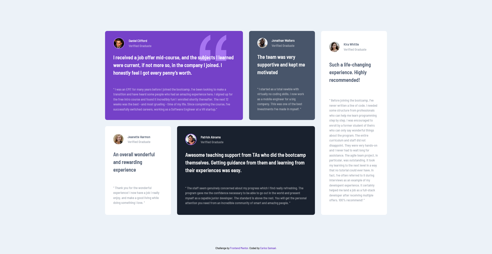

# Frontend Mentor - Testimonials grid section solution

This is a solution to the [Testimonials grid section challenge on Frontend Mentor](https://www.frontendmentor.io/challenges/testimonials-grid-section-Nnw6J7Un7). Frontend Mentor challenges help you improve your coding skills by building realistic projects. 

## Table of contents

- [Overview](#overview)
  - [The challenge](#the-challenge)
  - [Screenshot](#screenshot)
  - [Links](#links)
- [My process](#my-process)
  - [Built with](#built-with)
  - [What I learned](#what-i-learned)
  - [Continued development](#continued-development)
  - [Useful resources](#useful-resources)
- [Author](#author)
- [Acknowledgments](#acknowledgments)

## Overview

### The challenge

Users should be able to:

- View the optimal layout for the site depending on their device's screen size

### Screenshot

### Links

- Solution URL: [Add solution URL here](https://your-solution-url.com)
- Live Site URL: [https://Crtykwod.github.io/Frontend-Mentor/junior/d002/testimonial_grid/](https://Crtykwod.github.io/Frontend-Mentor/junior/d002/testimonial_grid/)

## My process

### Built with

- Semantic HTML5 markup
- CSS custom properties
- Flexbox
- CSS Grid
- Mobile-first workflow

### What I learned

I learned how to use CSS Grid to create a responsive grid layout. I also learned how to use the `:nth-child` pseudo-class to target specific elements in the grid. Additionally, I learned how to use the `grid-template-columns` property to define the number of columns in the grid.

### Continued development

I would like to continue focusing on responsive design and learning more about creating a fully responsive website. I would also like to learn more about accessibility and how to make my website more accessible to people with disabilities. Additionally, I would like to continue learning more about CSS Grid and how to use it to create more complex layouts.

### Useful resources

- [MDN Web Docs - CSS Grid](https://developer.mozilla.org/en-US/docs/Web/CSS/CSS_Grid_Layout) - This helped me understand how to use CSS Grid to create a responsive grid layout.
- [CSS-Tricks - A Complete Guide to Grid](https://css-tricks.com/snippets/css/complete-guide-grid/) - This is an amazing article which helped me finally understand how to use CSS Grid to create a responsive grid layout. I'd recommend it to anyone still learning this concept.

## Author

- Github - [Carlos Samuel](https://github.com/Crtykwod)
- Frontend Mentor - [@Crtykwod](https://www.frontendmentor.io/profile/Crtykwod)

## Acknowledgments

I'd like to thank [Codeium](https://codeium.com/) for their help on this project. Without their code review service, I wouldn't have been able to catch a few errors and improve my code. Thanks!