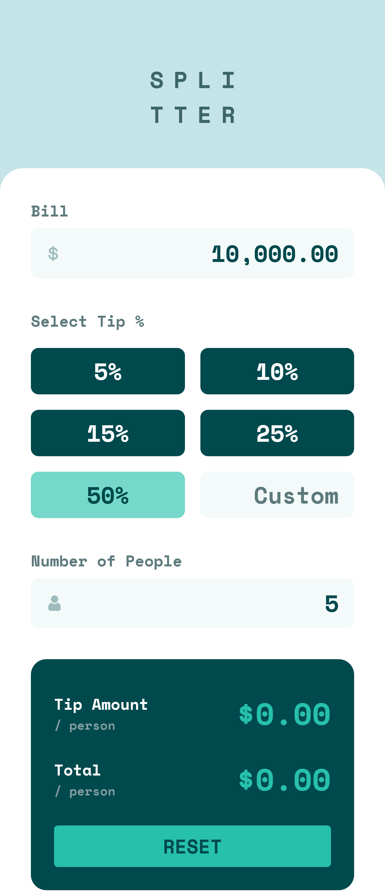
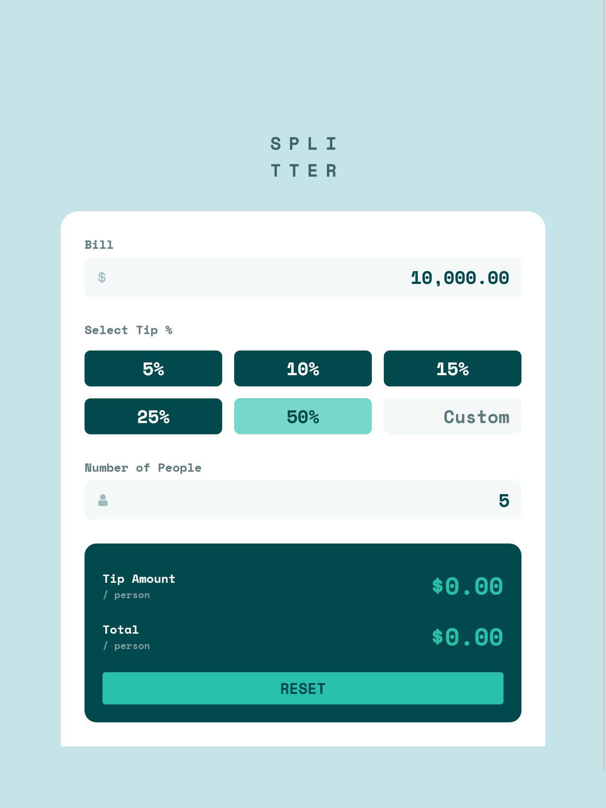
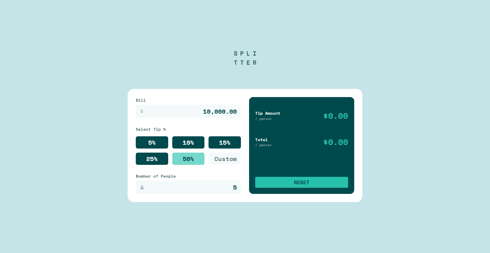

# Frontend Mentor - Tip Calculator App Solution

This is a solution to the [Tip calculator app challenge on Frontend Mentor](https://www.frontendmentor.io/challenges/tip-calculator-app-ugJNGbJUX). Frontend Mentor challenges help you improve your coding skills by building realistic projects.

## Table of contents

- [Overview](#overview)
  - [The challenge](#the-challenge)
  - [Screenshot](#screenshot)
  - [Links](#links)
- [My process](#my-process)
  - [Built with](#built-with)
  - [What I learned](#what-i-learned)
  - [Continued development](#continued-development)
- [Author](#author)

## Overview

### The challenge

Users should be able to:

- Calculate the correct tip and total cost of the bill per person
- View the optimal layout for the app depending on their device's screen size
- See hover states for all interactive elements on the page
- Input decimal values with proper formatting
- Handle large numbers with comma separators

### Screenshot

#### Screenshot Mobile


#### Screenshot Tablet


#### Screenshot Desktop


### Links

- Live Site URL: [crtykwod.github.io/Frontend-Mentor/junior/d005/tip-calculator-app](https://crtykwod.github.io/Frontend-Mentor/junior/d005/tip-calculator-app)
- Solution URL: 

## My process

### Built with

- Semantic HTML5 markup
- CSS custom properties
- Flexbox and CSS Grid
- Mobile-first workflow
- Vanilla JavaScript with modules
- BEM methodology

### What I learned

#### Debouncing for Performance
Implemented a debounce utility function that controls how often a function executes:

```javascript
export const debounce = (func, wait) => {
  let timeout;
  return function executedFunction(...args) {
    const later = () => {
      clearTimeout(timeout);
      func(...args);
    };
    clearTimeout(timeout);
    timeout = setTimeout(later, wait);
  };
};
```
This function prevents excessive calculations by waiting for user input to pause before executing. In our calculator, it ensures calculations only run after the user stops typing for 150ms, significantly improving performance.

#### Currency Formatting
Created a robust currency formatter that handles decimal places and thousand separators:

```javascript
currency: (input) => {
  let value = input.value.replace(/[^\d]/g, "");
  input.value = (numericValue / 100).toLocaleString('en-US', {
    minimumFractionDigits: 2,
    maximumFractionDigits: 2,
  });
}
```

#### Input Validation
Built a validation system that checks for zero values:

```javascript
export const validateInput = (input) => {
  const value = Number(input.value.replace(/,/g, ''));
  return {
    isValid: value > 0,
    errorMessage: value <= 0 ? "Can't be zero" : null
  };
}
```

### Continued development

I plan to focus on these areas in future projects:

- **Keyboard Navigation Support**: Enhance accessibility by implementing full keyboard control of the calculator, including better focus management between inputs and custom keyboard shortcuts for common actions like resetting or switching between tip percentages.

- **Reusable Number Formatting Components**: Create a modular number formatting system that can be easily reused across different projects, with support for various currency formats, decimal places, and locale-specific number representations.

- **Enhanced BEM Methodology**: Further improve the component structure using BEM, creating more modular and maintainable CSS by better organizing block elements and their modifiers, making the styling system more scalable for larger applications.


## Author

- GitHub - [Carlos Samuel](https://github.com/Crtykwod)
- Frontend Mentor - [@Crtykwod](https://www.frontendmentor.io/profile/Crtykwod)
