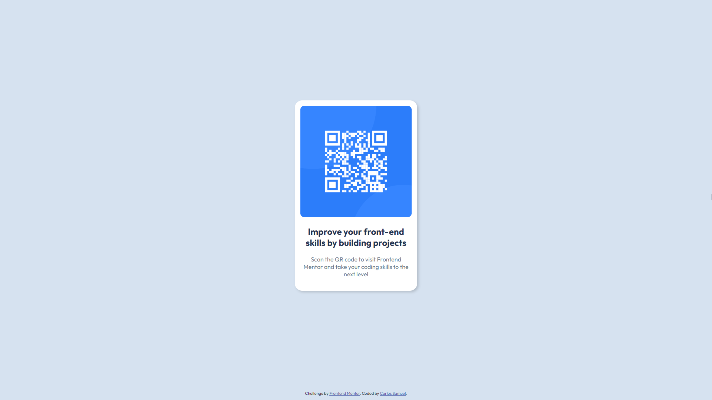

# Frontend Mentor - QR code component solution

This is a solution to the [QR code component challenge on Frontend Mentor](https://www.frontendmentor.io/challenges/qr-code-component-iux_sIO_H). Frontend Mentor challenges help you improve your coding skills by building realistic projects. 

## Table of contents

- [Overview](#overview)
  - [Screenshot](#screenshot)
  - [Links](#links)
- [My process](#my-process)
  - [Built with](#built-with)
  - [What I learned](#what-i-learned)
  - [Continued development](#continued-development)
  - [Useful resources](#useful-resources)
- [Author](#author)
- [Acknowledgments](#acknowledgments)

**Note: Delete this note and update the table of contents based on what sections you keep.**

## Overview

### Screenshot



### Links

- Solution URL: [github.com/Crtykwod/*/**/qr_code](https://github.com/Crtykwod/Frontend-Mentor/tree/main/d001/qr_code)
- Live Site URL: [crtykwod.github.io/*/**/qr_code/index.html](https://crtykwod.github.io/Frontend-Mentor/d001/qr_code/index.html)

## My process

### Built with

- Semantic HTML5 markup
- CSS custom properties
- Flexbox
- CSS Grid
- Mobile-first workflow

### What I learned

This challenge helped me understand flexbox concepts like flex-grow, flex-shrink and flex-basis. I used them to fix the footer at the bottom of the page.
It also helped me learning about Mobile-first workflow.

```css
.back {
  flex: 1 0 auto;
}

.footer {
  flex-shrink: 0;
}

```

### Continued development

I still have a lot to learn about flexbox, because it took me too much time in this project.

### Useful resources

- [Stack Overflow - Fix footer to bottom of page](https://stackoverflow.com/questions/18915550/fix-footer-to-bottom-of-page) - This helped me fixing the footer and taught me about flex property. It was very usefull!

## Author

- Github - [Crtykwod](https://github.com/Crtykwod)
- Frontend Mentor - [@Crtykwod](https://www.frontendmentor.io/profile/Crtykwod)
