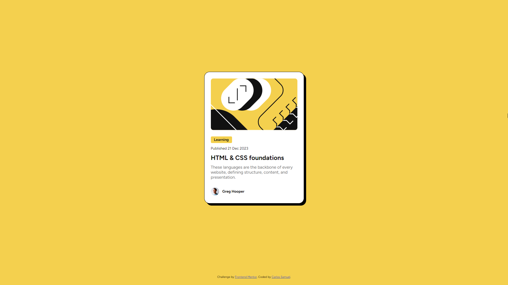

# Frontend Mentor - Blog preview card solution

This is a solution to the [Blog preview card challenge on Frontend Mentor](https://www.frontendmentor.io/challenges/blog-preview-card-ckPaj01IcS). Frontend Mentor challenges help you improve your coding skills by building realistic projects. 

## Table of contents

- [Overview](#overview)
  - [The challenge](#the-challenge)
  - [Screenshot](#screenshot)
  - [Links](#links)
- [My process](#my-process)
  - [Built with](#built-with)
  - [Continued development](#continued-development)
- [Author](#author)

## Overview

### The challenge

Users should be able to:

- See hover and focus states for all interactive elements on the page

### Screenshot

### Links

- Solution URL: [https://www.frontendmentor.io/solutions/blog-preview-card-with-custom-hover-and-focus-BikyKCHNq0](https://www.frontendmentor.io/solutions/blog-preview-card-with-custom-hover-and-focus-BikyKCHNq0)
- Live Site URL: [https://crtykwod.github.io/Frontend-Mentor/d002/blog_preview/](https://crtykwod.github.io/Frontend-Mentor/d002/blog_preview/)

## My process

### Built with

- Semantic HTML5 markup
- CSS custom properties
- Flexbox
- CSS Grid

### Continued development

I'm working hard on understanding better how grid and flex displays work

## Author

- GitHub - [Carlos Samuel](https://www.github.com/Crtykwod)
- Frontend Mentor - [@Crtykwod](https://www.frontendmentor.io/profile/Crtykwod)