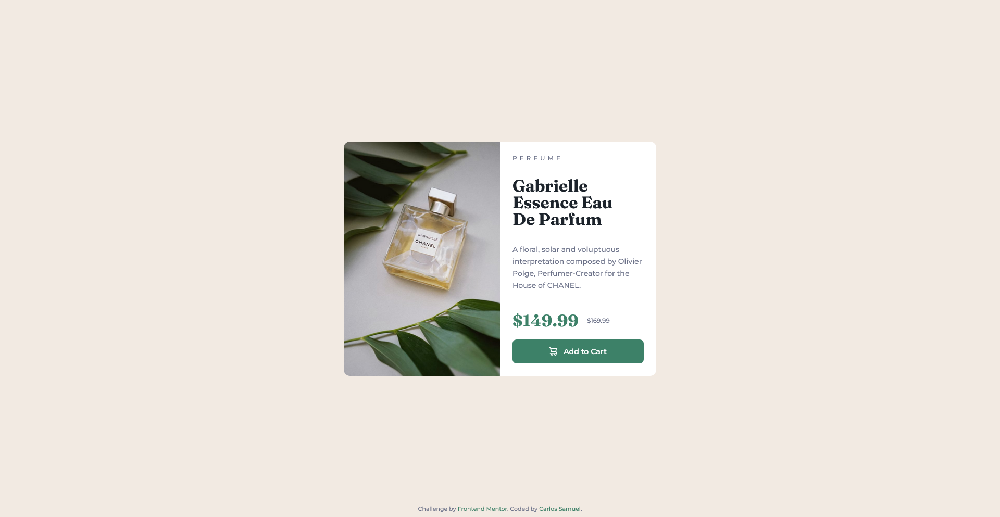

# Frontend Mentor - Product preview card component solution

This is a solution to the [Product preview card component challenge on Frontend Mentor](https://www.frontendmentor.io/challenges/product-preview-card-component-GO7UmttRfa). Frontend Mentor challenges help you improve your coding skills by building realistic projects. 

## Table of contents

- [Overview](#overview)
  - [The challenge](#the-challenge)
  - [Screenshot](#screenshot)
  - [Links](#links)
- [My process](#my-process)
  - [Built with](#built-with)
  - [Continued development](#continued-development)
- [Author](#author)

## Overview

### The challenge

Users should be able to:

- View the optimal layout depending on their device's screen size
- See hover and focus states for interactive elements

### Screenshot

### Links

- Solution URL: [https://www.frontendmentor.io/solutions/responsive-product-preview-card-using-media-queries-gN1IBRuHjh](https://www.frontendmentor.io/solutions/responsive-product-preview-card-using-media-queries-gN1IBRuHjh)
- Live Site URL: [https://crtykwod.github.io/Frontend-Mentor/newbie/d005/product_preview/](https://crtykwod.github.io/Frontend-Mentor/newbie/d005/product_preview/)

## My process

### Built with

- Semantic HTML5 markup
- CSS custom properties
- Flexbox
- CSS Grid
- Mobile-first workflow

### Continued development

This project was a fundamental part in my learning of the media queries usage, and I'm certainly going to study it even more.

## Author

- Github - [Carlos Samuel](https://github.com/Crtykwod)
- Frontend Mentor - [@Crtykwod](https://www.frontendmentor.io/profile/Crtykwod)

