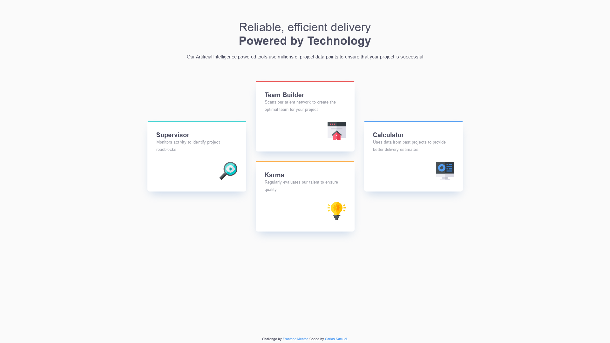

# Frontend Mentor - Four card feature section solution

This is a solution to the [Four card feature section challenge on Frontend Mentor](https://www.frontendmentor.io/challenges/four-card-feature-section-weK1eFYK). Frontend Mentor challenges help you improve your coding skills by building realistic projects. 

## Table of contents

- [Overview](#overview)
  - [The challenge](#the-challenge)
  - [Screenshot](#screenshot)
  - [Links](#links)
- [My process](#my-process)
  - [Built with](#built-with)
  - [What I learned](#what-i-learned)
  - [Useful resources](#useful-resources)
- [Author](#author)

## Overview

### The challenge

Users should be able to:

- View the optimal layout for the site depending on their device's screen size

### Screenshot



### Links

- Solution URL: [Add solution URL here](https://your-solution-url.com)
- Live Site URL: [Add live site URL here](https://your-live-site-url.com)

## My process

### Built with

- Semantic HTML5 markup
- CSS custom properties
- Flexbox
- CSS Grid
- Mobile-first workflow

### What I learned

I saw a video on YouTube telling more about CSS Vars (--var()) and I tried to apply it in my project, isn't the best usage, but at least it is an use :v

```css
.shadow {
  --_clr-box-shadow: var(--clr-box-shadow, pink); /* Defines an local variable (with an underline before) that only works in the scope. Then, define it's value with another var() and a fallback*/
  box-shadow: 15px 0 30px -25px var(--_clr-box-shadow) /* Uses the var() in a property */
}

.box1.shadow {
  --clr-box-shadow: red; /* Makes the shadow red on the element with the .box1 and .shadow classes */
}

.box2.shadow {
  --clr-box-shadow: pink;
}
```

In this way, you don't need to redeclare `{box-shadow: 15px 0 30px -25px;}` everytime with an different color, you just need to declare the color.

### Useful resources

- [Using CSS custom properties like this is a waste](https://www.youtube.com/watch?v=_2LwjfYc1x8) - The video about CSS Vars (--var())

## Author

- GitHub - [Carlos Samuel](https://github.com/Crtykwod)
- Frontend Mentor - [@Crtykwod](https://www.frontendmentor.io/profile/Crtykwod)
