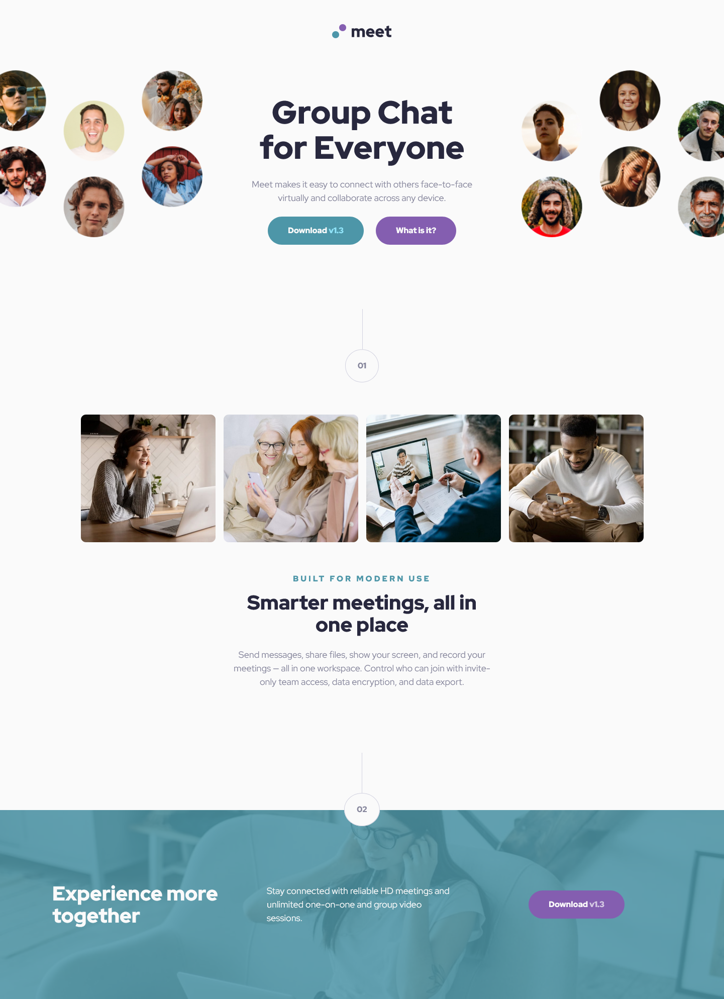

# Frontend Mentor - Meet landing page solution

This is a solution to the [Meet landing page challenge on Frontend Mentor](https://www.frontendmentor.io/challenges/meet-landing-page-rbTDS6OUR). Frontend Mentor challenges help you improve your coding skills by building realistic projects. 

## Table of contents

- [Overview](#overview)
  - [The challenge](#the-challenge)
  - [Screenshot](#screenshot)
  - [Links](#links)
- [My process](#my-process)
  - [Built with](#built-with)
  - [What I learned](#what-i-learned)
  - [Continued development](#continued-development)
  - [Useful resources](#useful-resources)
- [Author](#author)

## Overview

### The challenge

Users should be able to:

- View the optimal layout depending on their device's screen size
- See hover states for interactive elements

### Screenshot

### Links

- [Check the solution here on GitHub](https://github.com/Crtykwod/Frontend-Mentor/tree/main/newbie/d007/meet_landing_page)
- Live Site URL: [Check the live site here](https://crtykwod.github.io/Frontend-Mentor/newbie/d007/meet_landing_page/)

## My process

### Built with

- Semantic HTML5 markup
- CSS custom properties
- Flexbox
- CSS Grid
- Mobile-first workflow
- BEM methodology

### What I learned

I learned how to use CSS Grid to create a responsive layout. I also used CSS custom properties to define colors and fonts in a more organized way. This was my first project using BEM methodology, and I found it very useful to write more organized CSS classes. I used BEM to organize my CSS classes in a more structured way, by dividing them into three types: block, element and modifier. For example, for the `header` block, I created the following classes: `header__logo`, `header__nav`, `header__nav--active`, `header__nav--desktop-hidden`, etc. This way, I could easily target the elements I wanted to style and keep my CSS organized.

### Continued development

I want to continue focusing on improving my skills in using BEM methodology. Although I found it very useful in organizing my CSS classes in a more structured way, I know there's still room for improvement. I want to continue using BEM in my future projects and refine my skills in creating more organized and structured CSS classes.

### Useful resources

- [BEM Official Website](https://getbem.com/) - This is an amazing article which helped me finally understand BEM. I'd recommend it to anyone still learning this concept.

## Author

- Github - [Carlos Samuel](https://github.com/Crtykwod)
- Frontend Mentor - [@Crtykwod](https://www.frontendmentor.io/profile/Crtykwod)